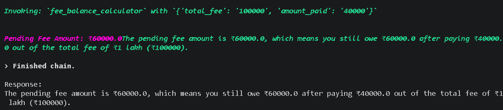
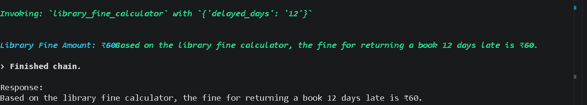
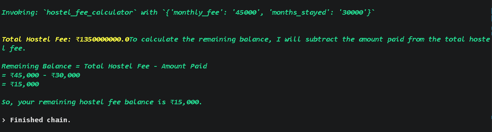
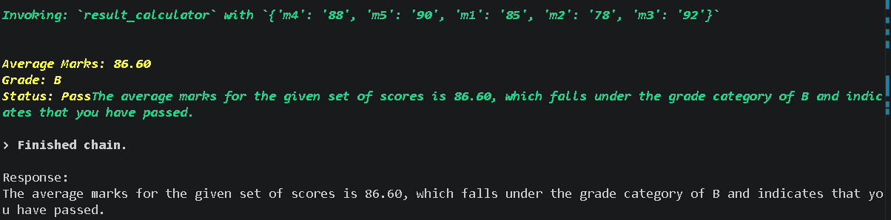
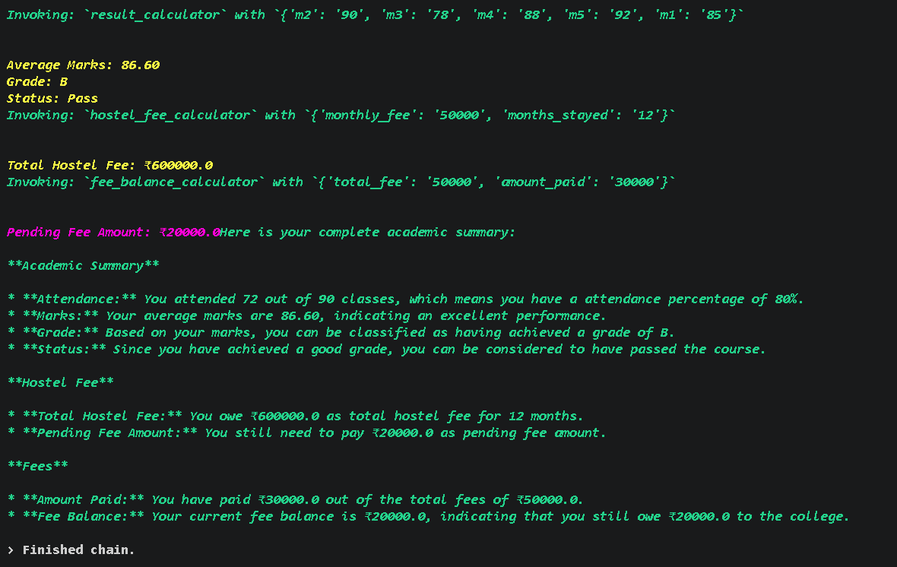

# Smart College Assistant

An AI-powered College Assistant built using LangChain Tool Calling Agent, Ollama, and Llama 3.2.

## Features

* Attendance Calculator
* Result Calculator
* Fee Balance Calculator
* Library Fine Calculator
* Hostel Fee Calculator
* Student Information Tool
* Multi-Tool Query Support

## Tech Stack

* Python
* LangChain
* Ollama
* Llama 3.2
* AgentExecutor
* ChatPromptTemplate

## Sample Queries

### Attendance

I attended 72 classes out of 90. Am I eligible for exams?

### Fee Balance

My total fee is 50000 and I have paid 30000. How much is pending?

### Multi-Tool Query

I attended 72 classes out of 90 and paid 30000 out of 50000. Give both attendance and fee details.

## Project Architecture

User Query → LangChain Agent → Tool Selection → Tool Execution → Final Response

## Demo Screenshots

### Attendance Calculator

### Fee Balance Calculator

### Library Fine Calculator

### Hostel Fee Calculator

### Result Calculator

### Multi Tool Query

## Author

K. Sai Kiran Reddy

Registration Number: 24BAI1041
